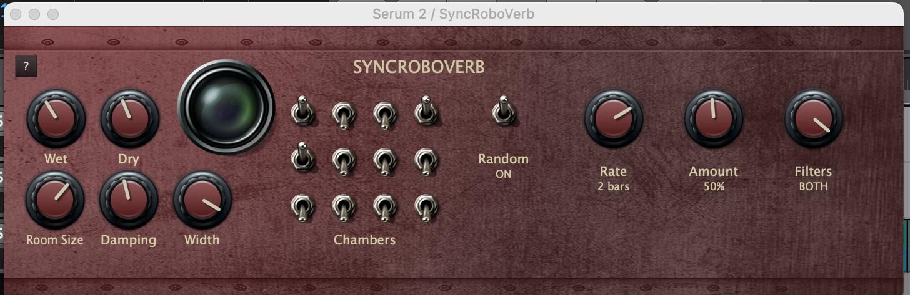

# Roboverb
Robotic reverb, I guess.



Roboverb is designed to produce a distinctive, "robotic" or metallic reverb sound, and its parameters are somewhat unique compared to typical reverb plugins. Here's a breakdown:

* **Core Design:**
    * Roboverb is based on a Schroeder digital reverb model.
    * It utilizes a network of 8 Comb Filters and 4 All Pass filters. This filter network is what gives Roboverb its characteristic sound.
* **Key Features and Parameters:**
    * **Filter Switches:**
        * A significant aspect of Roboverb is the presence of switches that allow you to toggle the Comb and All Pass filters on or off. This provides a way to radically alter the reverb's tonal character.
        * These switches are a key part of the "robotic" effect, as they allow for manipulation of the filter chain.
    * **Tuning of Filter Chain:**
        * The "not-so-secret sauce" of Roboverb lies in the specific tuning of its filter chain. This tuning contributes to the plugin's metallic and unique reverb sound.
    * **Emphasis on Simplicity:**
        * The plugin is designed to be relatively straightforward, prioritizing ease of use over a vast array of numerical parameters.
        * Roboverb's design philosophy is to allow for drastic sound changes with a minimal amount of parameter changes.
* **Overall Character:**
    * Roboverb is not intended to emulate natural, realistic reverb. Instead, it aims to produce creative and experimental reverb effects.
    * It is designed for those who want a very unique, and sometimes "creepy" reverb sound.

In essence, Roboverb's parameters revolve around manipulating its internal filter network through on/off switches, rather than traditional reverb controls like decay time or room size. This design choice results in its distinct sonic signature.

#### Building
Roboverb can be built with CMake.

```bash
git submodule update --init --recursive --depth=1
cmake -Bbuild -GNinja
cd build
ninja -j4
```
