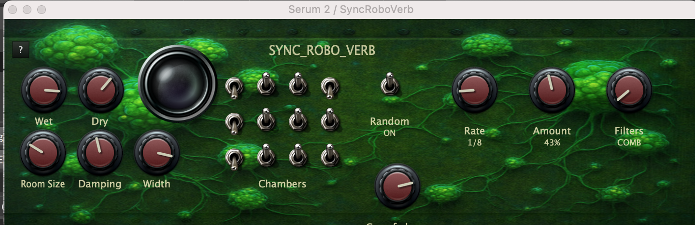

# SyncRoboVerb
*A tempo-synchronized robotic reverb with dynamic filter randomization*



SyncRoboVerb is an enhanced evolution of the original Roboverb plugin, designed to produce distinctive "robotic" or metallic reverb textures that now evolve dynamically with your music's tempo.

## About Schroeder Reverbs

SyncRoboVerb is based on the classic **Schroeder digital reverb algorithm**, first described by Manfred Schroeder in his pioneering 1962 AES paper. As detailed in [ValhallasDSP's excellent explanation](https://valhalladsp.com/2009/05/30/schroeder-reverbs-the-forgotten-algorithm/), Schroeder reverbs use a distinctive approach:

- **Parallel comb filters** feeding into **series allpass filters**
- Creates an "echo density that increases with time" for more natural decay
- By placing allpass filters in feedback paths, achieves non-exponential decay characteristics
- Forms the foundation for later professional reverb designs by manufacturers like Lexicon

The Schroeder approach can sound metallic or ringy in basic implementations, but this "robotic" character is exactly what makes it perfect for creative, experimental reverb effects.

## Core Features

### **Traditional Schroeder Architecture (inherited from original Roboverb)**
- **8 Comb Filters** + **4 All Pass Filters** in classic Schroeder configuration
- **Manual Filter Switches**: Toggle individual comb and allpass filters on/off for dramatic tonal changes
- **Traditional Controls**: Room Size, Damping, Wet/Dry levels, Width, Freeze Mode
- **Specially Tuned Filter Chain**: The "not-so-secret sauce" contributing to the metallic, robotic character

### **New: Tempo-Synced Randomization System** 🎵
- **Random Enable**: Master on/off switch for the randomization system
- **Rate Control**: Sync randomization to musical divisions (16th notes to 8 bars)
- **Amount Control**: Probability of switch changes (0% = static, 100% = maximum chaos)
- **Filter Targeting**: Choose to randomize Comb filters only, AllPass filters only, or Both
- **Real-time Visual Feedback**: Watch switches dance in sync with your music's tempo

## What Makes It Special

**Original Philosophy Enhanced**: While the original Roboverb emphasized simplicity and dramatic sound changes through minimal parameter adjustments, SyncRoboVerb extends this concept into the time domain. Now your reverb can evolve automatically, creating ever-changing textures that stay perfectly synchronized to your music.

**Creative Applications**:
- **Evolving Textures**: Create reverbs that change character throughout your track
- **Rhythmic Effects**: Use fast rates (16th/8th notes) for rhythmic reverb patterns  
- **Ambient Evolution**: Use slow rates (2-8 bars) for gradually shifting ambient textures
- **Controlled Chaos**: Fine-tune the amount of randomization from subtle variations to complete unpredictability

**Sound Character**: Not intended to emulate natural reverb, SyncRoboVerb is designed for producers and sound designers seeking unique, experimental, and sometimes "creepy" reverb effects that move and breathe with your music.

## Acknowledgments

SyncRoboVerb builds upon the excellent foundation of the original Roboverb plugin, extending its distinctive Schroeder-based architecture with tempo-synchronized randomization capabilities. Special thanks to the original developers for creating such a solid base for experimentation.

## Building
SyncRoboVerb can be built with CMake.

```bash
git submodule update --init --recursive --depth=1
cmake -Bbuild -GNinja
cd build
ninja -j4
```
